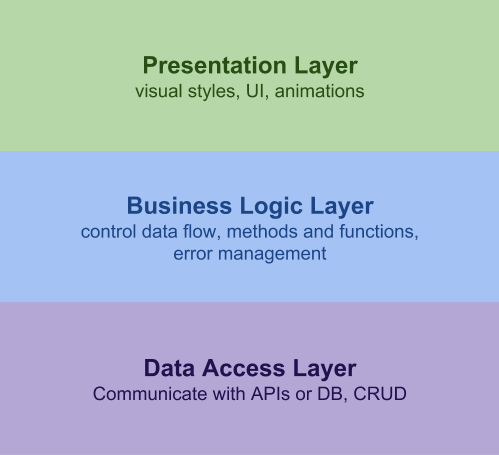
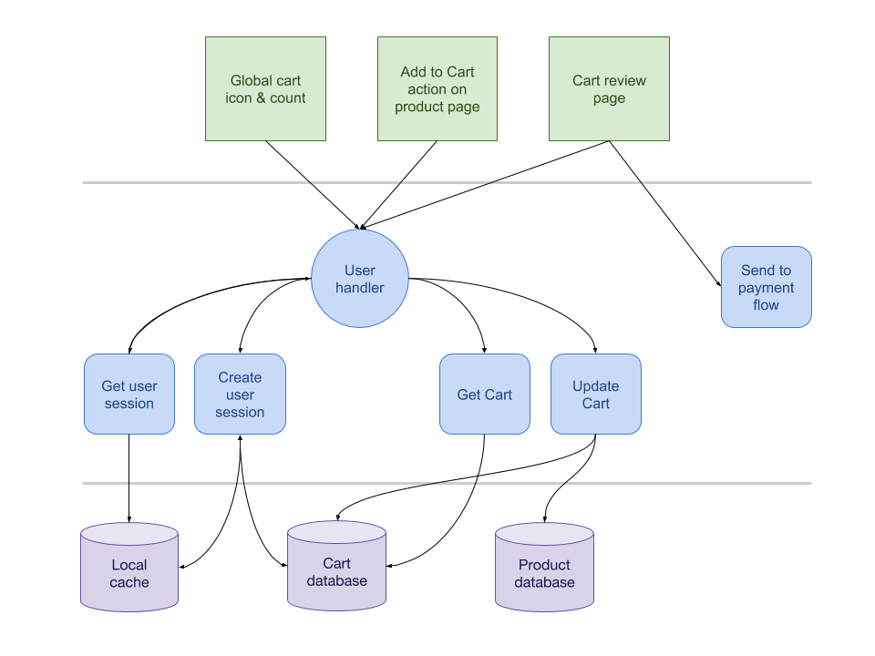

# Software Design Principles



Layered architecture is a design pattern that we can use to visualize how we would organize
functionality within our application. Each layer has a role and responsibility. When using a
layered architecture approach, there are common design principles that should be considered.




Let's look at the example of an online shopping cart feature. Consider how we breakdown the
functionality into different layers, how each layer will communicate with each other, and
what that could mean for the overall architecture of our application. (ex. Where should the
different databases live? What happens if we need to add authentication? How do we handle
security and validation? How do we handle errors?)


## Separation of Concerns

Logical separation between pieces or "layers" of an application.
```jsx harmony
class Cart extends Component {

  render() {
    return (
        <p class="total">
          { this.state.subTotal * 1.13 } // add tax to subTotal
        </p>
      )
  }
}
```
In the above example we are calculating tax in a component meant for just rendering some UI.
What are some problems with this?

Two ways:
```jsx harmony
render() {
  return (
      <p class="total">
        { this.props.total } // this component should not be responsible at all for calculations
      </p>
    )
}
```
**OR**
```jsx harmony
import TaxCalculator from 'tax-calc';

class Cart extends Component {

  render() {
    return (
        <p class="total">
          { this.calculateTotal(this.state.subTotal) }
        </p>
      )
  }

  calculateTotal(subTotal) {
    const ontarioTaxCalculator = TaxCalculator('on');
    const tax = ontarioTaxCalculator.getTax(subTotal);
    return subTotal + tax;
  }
}
```
Another example of Separation of concerns in React would be using Redux to handle state changes and propagation throughout application.

## Loose vs Tight coupling

### LoD / Encapsulation

Law of Demeter or principle of least knowledge. Components should not know or attempt to modify the inner workings of others (black box).
React example:
```jsx harmony
const options = ['one', 'two', 'three'];
const dropdown = <DropdownComponent items={ options } />;

// THIS IS TERRIBLE NEVER DO THIS
dropdown.state.optionList.orderAscending();
```
Logic related to how the dropdown renders itself should be *encapsulated* within the dropdown component.
No one outside should be directly calling methods on properties on this dropdown component.

Any functionality that should be "public" should be exposed through a clear interface with limited "side effects".
i.e.
```jsx harmony
dropdown.sortOptions('asc');
```


### Single Responsibility

Consider:
```jsx harmony
function sortAndReverseString(string) {};
```
This function is challenging to debug & write automated tests for. How do we know if the sorting is failing or the reversing is failing if both are manipulating the string.

What if we only want to sort? Or only reverse?
```jsx harmony
function sort(string) {
  return string.split('').sort().join('');
}

function reverse(string) {
  return string.split('').reverse().join('');
}
```
We now have 2 discrete functions that can be individually used, tested or debugged.
The responsibility of each function is clearly defined by the name (or by tests that describe it).


### Composition

Building on the previous example, how can we compose small, well-defined, discrete pieces of functionality to build more complex functionality.

```jsx harmony
// Straight forward
const sortedString = sort('fedcba'); // abcdef
const sortedAndReversed = reverse(sortedString); // fedcba

// one-liner
const sortedAndReversed = reverse(sort(myString))
```

Some libraries provide more functionality for composing functions:
```jsx harmony
const sortAndReverse = compose(sort, reverse);
sortAndReverse('fedcba') // fedcba

or ES6 version
const sortAndReverse = string => reverse(sort(string));
```


## DRY

Don't repeat yourself!

But also don't try to optimize prematurely.

When you discover duplicated functionality, think about how it can be encapsulated and shared.

In the UI: duplicated markup should be separated into it's own component and configured via props.

In the business logic: duplicated code can be separated into it's own module with a public 'interface' to be used by any other module.


### Abstraction

Abstraction can be used to eliminate tight coupling in a system or to mask complexity in some implementation.

Meant to separate functionality from it's implementation in order to provide flexibility in growing/evolving systems.

```jsx harmony
fetchSomeData()
  .then(data => {
      // do something with data
      console.log('Successfully fetched data:', data);
    })
  .catch(error => {
      console.log('Failed to fetch data:', error);
    });
```
**OR**

```jsx harmony
import logger from './logger';

fetchSomeData()
  .then(data => {
      // do something with data
      logger.log('Successfully fetched data:', data);
    })
  .catch(error => {
      logger.error('Failed to fetch data:', error);
    });
```
