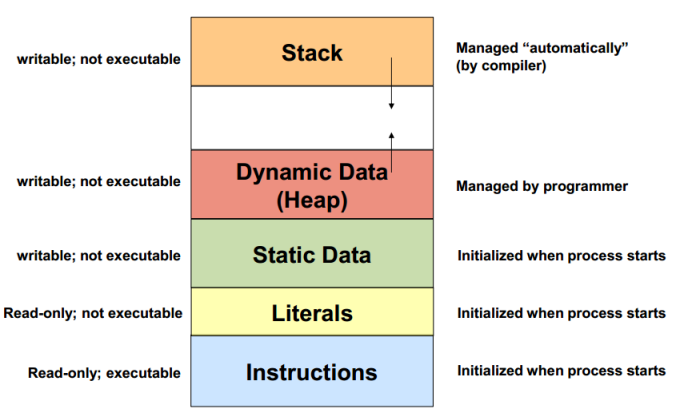

# Under the Hood


## Compilers and Interpreters

**Compilers** take code written in a programming language and output it as low-level 
assembly / machine code, that can be directly and executed by the underlying hardware or
virtual machine that it runs ons.  The assembly code is very terse and not meant to be 
written or read by humans (not anymore at least).

**Interpreters** take code written in a programming language and run it directly.  This
is basically code running code, and has the following pros/cons:

Pros
- Code can be distributed as source and run on any platform that has the interpreter.
- You can update the source and just restart the VM without any complex compiling.
- There aren't any of the compile-time optimizations that will often throw the developer
off.

Cons
- The interpreter itself can often have a large memory footprint with can become a problem on
embedded systems and mobile devices.
- The interpreter can have performance costs as it loads the raw code / script.
- Because the code isn't compiled, it can blow up at runtime.

Compiler and interpreters of functional and object-oriented programming languages share a set
of core computing and programming concepts:
- Expressions
- Control Flow
- Call Stacks
- Memory Management


### JavaScript Engines

JavaScript is a core technology that is actually an interpreter (at least in concept).  There 
are many flavours of JS engines that we use today:
- [V8](https://developers.google.com/v8/) for Chrome, NodeJS, and MongoDB (C++)
- [SpiderMonkey](https://developer.mozilla.org/en-US/docs/Mozilla/Projects/SpiderMonkey) for Firefox (C++)
- [Chakra](https://github.com/Microsoft/ChakraCore) for IE / Edge (C++)


## Memory

The fuel of any process is memory (any clock cycles). 

Memory is a limited resource, while time (at least to a computer) is not.  It can be extremely 
constrained on mobile and embedded systems where the device has limited resources in an effort
to reduce size, cost, and power consumption.

Regardless of the language or system, the general structure of memory in computing is fairly 
similar:



### Code
You code gets loaded into memory so that it can be run efficiently, although it can be paged in
and out from storage.

### Literals
Numbers and static text is often put into a special space of memory so that it isn't repeated
everywhere so that things are kept DRY.

### Static Data
Global variables are scoped in a special space that can be read/written from anywhere and is 
allocated up front when the program starts.

### Dynamic / Heap Data
All reference type data is allocated on the "heap", an area of memory where potentially long-running
or complex data structures are strored.  In JavaScript this is where string, arrays, and object (and
their values) are stored.

### Call Stack
Any method call context goes here (see below).


## Call Stacks

Most programming languages that we work with have the concept of a call stack, essentially the
context involving a function.  

Each time a function is called a "frame" is added to the stack of calls as an efficient way for the 
executing program to capture parameters, local variables, and return values that all get thrown 
away after a method or closure finishes executing.
 


A couple things to note: 
- The call stack doesn't include the memory code of the function itself, so calling a large 
function 10 times doesn't cost any more memory than calling a small 10 times. 
- A call stack does grow with the number of variables that you add.  So a calling a function 
with 100 parameters costs a lot more memory than a function with 2 parameters.
- The call stack has a limit - it isn't infinite.  The size depends on the engine for example most 
max out at around 50K calls.


## Recursion

### Why do I need it?
Recursion is a **software design pattern** that solves a set of computer science problems that
involve performing repeated computations as part of an algorithm, sometimes related to processing
patterns of data.

Some examples of where recursion could be helpful include:
- Performing mathematical computations (e.g. exponents, factorials).
- Traversing data structures evaluate or search for a value (e.g. parsers, calculators, search engines).


### What does it look like?

The following code demonstrates a recursive method that has an issue with it:
```javascript
function factorial(n) {
    return n * factorial(n - 1);
}
```

All recursive methods need to have some termination state, which typically takes the form of
some conditional branch that continues or ends the recursive cycle.

 ```javascript
 function factorial(n) {
    
    // terminal or base case
    if (n === 1) {
       return 1;
    }
    
    // recursive loop
    return n * factorial(n - 1);
 }
 ```

In the case above the code works in terms of functional correctness, however what about the 
scalability of the problem space?  For example, what happens if we execute the following:

```javascript
factorial(1000000);  // Stack-overflow exception!
```

