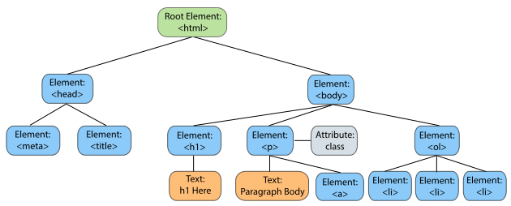
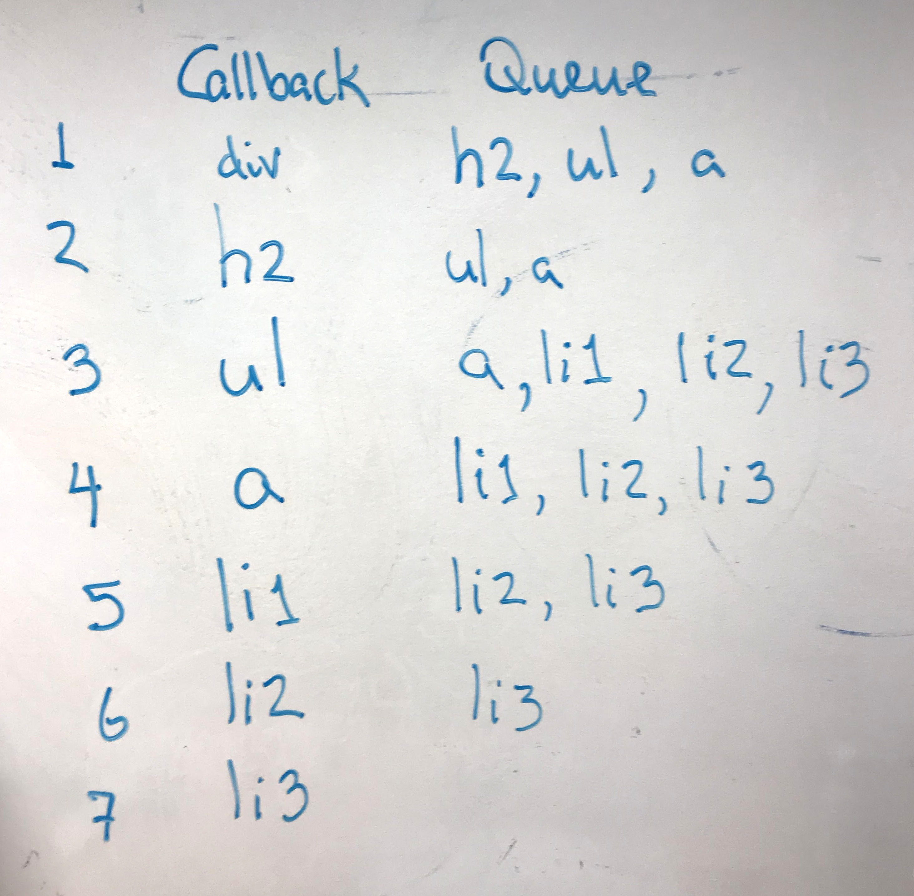

## Trees

What is a tree?
A hierarchical data structure with a root node, and subtrees of children with a parent property. Let's use the DOM as an example...



I know we are all familiar with what the DOM is... that really cool interface that allows programs and scripts to dynamically access and update the content, structure, and style of a document. 

## Let's take a look at how you would implement it...

### Let's define our Node and Tree
```javascript
class Node {
  constructor(value) {
    this.data = value;
    this.parent = null;
    this.children = [];
  }
}
```

```javascript
class Tree {
  constructor(node) {
    this.root = node;
  }
  
  // functions to edit / manage the tree
  ...
}
```

### How is this used?

Let's build it!
For a simple example, let's build the following DOM (yes, a much smaller, simpler version)


### How does it look like programmatically?

Well, using our definitions above, we can create the tree like this:

```javascript
// Here are all of the nodes that we'll need
Node div = new Node("<div");
Node h2 = new Node("<h2>");
Node ul = new Node("<ul>");
Node li1 = new Node("<li>");  
Node li2 = new Node("<li>");  
Node li3 = new Node("<li>");  
Node a = new Node("<a>");

// let's declare our tree with our root node
Tree myTree = new Tree(div);
  
// but they need relationships! Let's take care of that here  
// our root "div" has 3 children
div.children.push(h2);
div.children.push(ul);
div.children.push(a);

// our ul child has 3 children of its own
ul.children.push(li1);
ul.children.push(li2);
ul.children.push(li3);

// don't forget the parent properties
h2.parent = div;
ul.parent = div;
a.parent = div;
li1.parent = ul;
li2.parent = ul;
li3.parent = ul;
```

Awesome! We've written our DOM. Now what?

What's the DOM again? What do we want to do? 
If we want to edit and manage our DOM, we better now how to traverse it.
To traverse our tree, our Tree class will need some additional functionality.

## What does a tree traversal look like?

Here's an example with recursion and callbacks...

```javascript
  // need to setup the initial state
  traverse(Node node) {
    Queue q;
    q.push(root);
    traverse_recursive(q);
  }
  
  traverse_recursive(callback) {
    // it's empty! we're done
    if q.empty() return;

    // perform our callback on our node
    Node n = q.pop();
    callback(n);
    
    // continue with our children
    node.children.forEach(child => q.push(child));
    traverse_recursive(q);
  }
```

So... now if I called
```javascript
myTree.traverse((node) => console.log(node.data));
```

This is how it is iterating through:


And I would see printed on the screen:
```javascript
<div>
<h2>
<ul>
<a>
<li1>
<li2>
<li3>
```

Another way to traverse a tree that scales for large data and illustrates what recursion does would be to **unwind** the recursive function:

```javascript
  traverse(callback) {
  
    const stack = [];
    let node = this.root;
    while (node) {
    
      // evaluate current node
      callback(node);

      // evaluate all children, pushing them to the stack
      node.childred.forEach(child => stack.push(child));
      
      // move to next child in sequence
      node = stack.length === 0 ? null : stack.shift();
    }
  }

```


Your callback can be anything here... a function to return all image type children, a counter function to find the number of images, a function that manipulates certain nodes, etc...

### Final thoughts on the DOM

Because it is so important to quickly access, read, change your DOM tree, on top of being able to traverse the tree, you are also provided with hash tables (dictionaries) of elements by id, to quickly look up specific elements (or nodes) of your tree by index. Hence, why you can use calls like:

```javascript
let object = document.getElementById('myId');
```
or with jQuery:
```javascript
let jQueryObject = $('#myId'); 
```

So when needed, you can also look at combining data structures.


## Another example please

### Words with Friends


