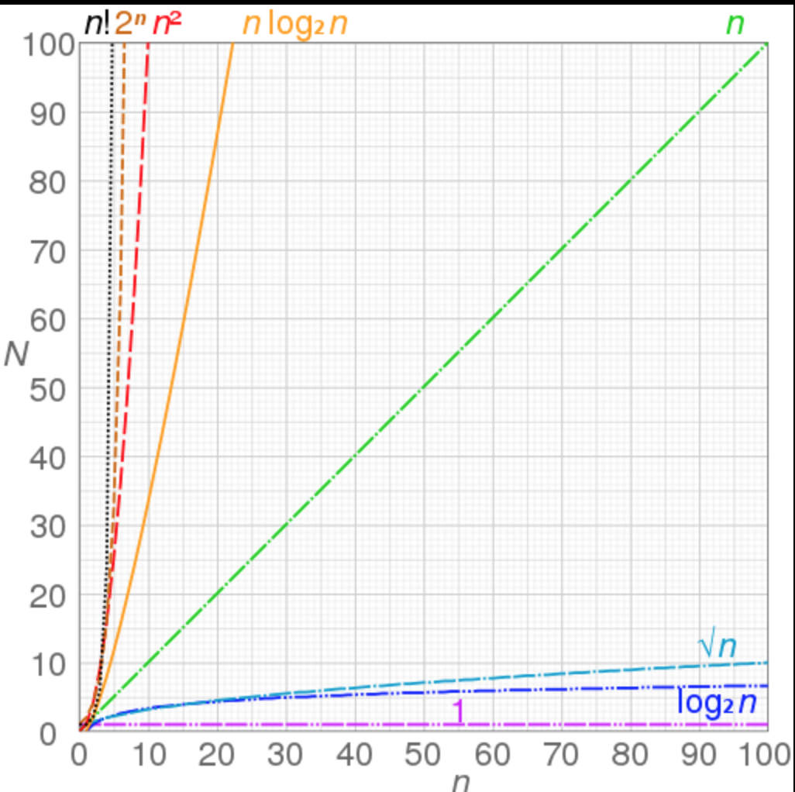

# Complexity

## Linear Search
For the previous section of the contacts list, say you wanted to find 'Amy' within the list of length 8. What would be an approach to look for that object in an array?

One approach is using Linear Search, starting from the first element in the array, we iterate to the next element to check if it is the element with the first name 'Amy'. We continue until we find the element that matches our criteria. 

For more details on Linear Search, check out [Linear Search](http://www.geeksforgeeks.org/linear-search/)

So how many operations did that take?
Given our array list of  
 **[ Fry, Leela, Bender, Professor, Amy, Zapp, Hermes, Zoidberg]**  
,using Linear Search approach, it would take 5 iterations to find Amy.

How many iterations will it take to find Fry? Zoidberg?

With what we can deduce from this quick example. We can determine that the number of iterations to find what we need through Linear Search has the relation of *n* elements of the array = *n* operations. We represent this with Big-O notation: O(n) 

Represented by the green line below:

*Source: https://en.wikipedia.org/wiki/Big_O_notation *

Linear Search works great for the purposes of our example Contact List. But now imagine you have array list of 1,000,000 elements, and the element you are looking for could possibility be the last element in the array. That could really have an impact on performance and usability.

### Binary Search
Another well known search algorithm is [Binary Search](http://www.geeksforgeeks.org/binary-search/). What is the time complexity Big-O of Binary Search? Will that perform better that Linear search?

## Understanding Performance and Complexity
This section is to introduce how we use Big-O notation to analyze and compare algorithms for searching; this can also be applied with sorting algorithms as well. When you know a few characteristics of your data and the needs of your feature, you can use Big-O to help you pick the appropriate algorithm for your purpose.

