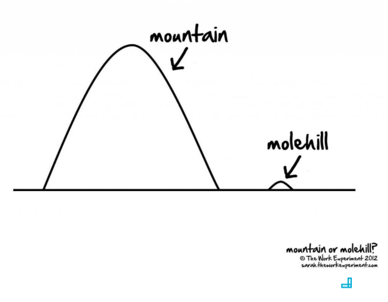

# Optimization

### What is Optimization?

Imagine you're making dinner and you require 5 items from the refrigerator. You'll need to get the items from the refrigerator to the stove top where you're preparing your meal.

Is it more effective to make 5 separate round trips between the refrigerator and the stove top?

Can you carry multiple items with you at one time? Transport it all in one trip?

What if 2 of the items are very large and the other 3 are quite small?

Hopefully by this point, you're getting a sense of what we mean by optimization.

In short, how can I accomplish the same result with the least amount of effort, energy, space, cost, etc.

## Great software today is often preferable to perfect software tomorrow.

### Optimization Best Practices

#### Rule 1:  Don’t Optimize
Premature optimization can often come at the cost of maintainability.  You are building for other developers, not a compiler.

#### Rule 2:  Don’t Optimize Yet
Until you see the pieces come together, you’re not sure of what you are optimizing.

#### Rule 3:  Profile First
Use your tools to see what you are actually optimizing. Modules that you "believe" need optimizing may not really be an issue. You may discover it's other modules that are hurting your application's performance. Collect real data and investigate options before changing the code.

### It's all relative...

### Things To Consider

### Why Do I Care?

