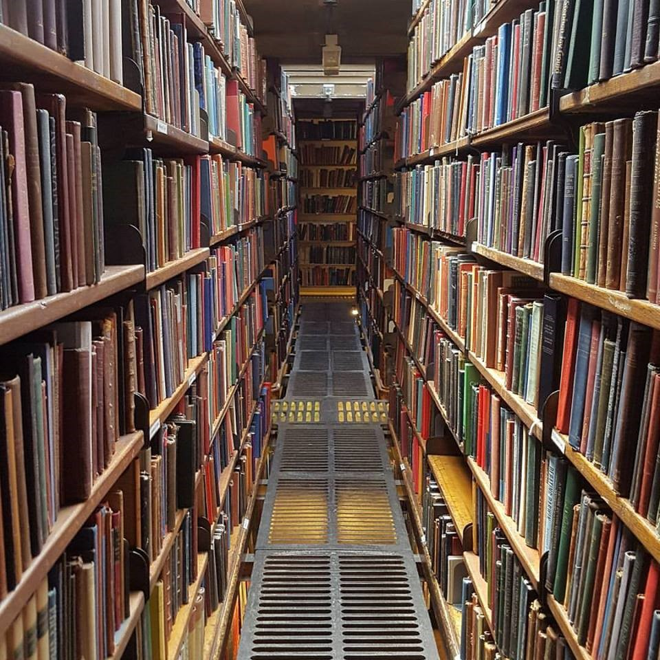

# Space & Time

## Can we sort this pile of books?

Given a relatively small collection, we may not notice the difference between many of the more popular sorting algorithms. Even a measurable improvement will be minimal; perhaps barely visible.

## Now what !?

We can see that as the size of the collection increases, the sorting strategy we choose has a significant impact. The amount of time could increase exponentially (literally!). The amount of space (ie. memory) that is required to maneuver the collection's items could be significant -- or possibly even impossible.

In computer science, when we say 'Space and Time' what we really mean is 'Memory' and 'Running Time'. Often these two priorities compete against each other, and you will be forced to find a balance between them that best serves the specific solution.

---
### Details to consider

* Data structure used to represent the "item"
* Expected number of items in the collection
* Size of each item
* Amount of effort involved with moving (re-ordering) the items
* Time available to complete the task
* Amount of free memory available to complete the task
