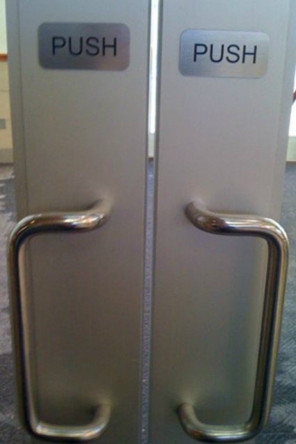
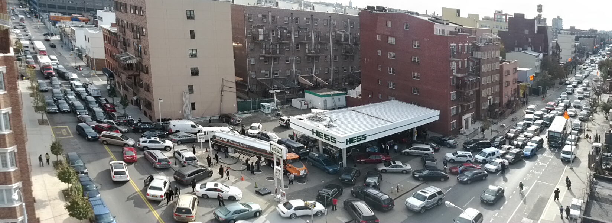

# Key Architectural Concepts

### Maintainability
The ease with which a component can be maintained and repaired.

 

### Pragmatism
The practice of ensuring that a component is designed with an orientation 
around usefulness.

 

### Reliability
The ability for a system to consistently perform according to its 
specifications over time.

 

### Scalability
The ability of a system to process a growing amount of work, both in terms of 
volume and size.

##### Volume

##### Size

 

### Availability
A measure of whether of how often a system can be used by those who need it.

 
