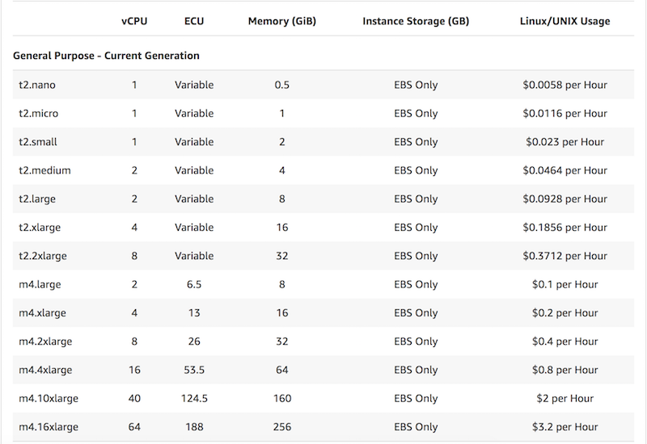
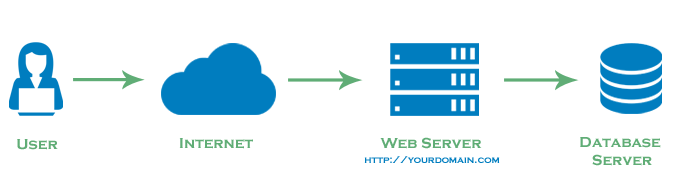
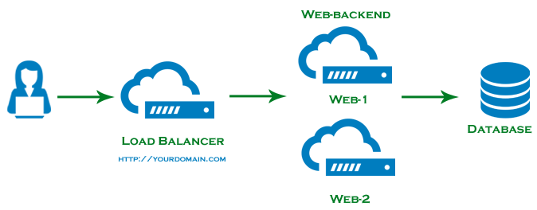
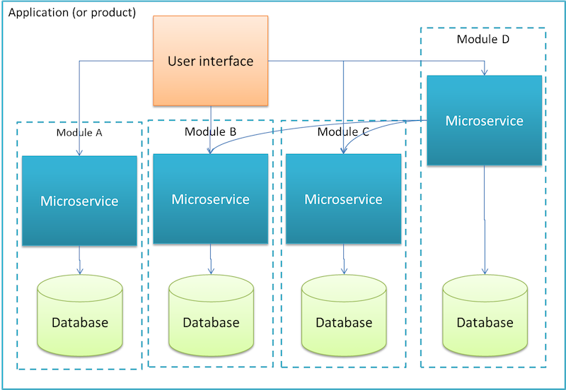

# Service Design

### Scalability in practice


#### Volume

In the context of a server, volume refers to number of requests (per minute/per second) or I/O.

Due to the Node.js being single-threaded and non-blocking,
it is built to handle high request volume provided the
process is not performing CPU intensive work.

The server will continue to handle more and more incoming requests
until the process runs out of memory or the CPU hits 100% usage and the
app will crash.

#### Size

Scalability with respect to size refers to the magnitude of work
involved in carrying out some operation.
These operations can either be **blocking** or **non-blocking** - consider a fast food restaurant.

These types of tasks will cause a spike in CPU usage and block the
current thread until completion.
Examples: Image processing, Data crunching

For a single-threaded process like a Node.js application this is **bad**.
The server will essentially lock up and not handle any incoming requests
while carrying out the operation.

##### Strategies

Your backend can use many different strategies to **scale up** the
maximum concurrent users that can be handled or the amount of work
the server can handle.

###### Vertical scaling

Boost RAM and CPU on a single server to increase capacity



Involves the least amount of work however the cost greatly increases
as demands increase. Eventually you will still hit a limit.


###### Horizontal scaling

Load Balance across multiple servers running instances of the same application

Typical client-server relationship with **no** load-balancing



Basic implementation of load-balancing



Load balancing allows **horizontal scaling** of web servers.
In order to be able to horizontally scale, these instances of the same
server must be **stateless**.

What is does it mean for a server to be stateless?

How can state be shared across multiple server instances?
- Layer-4 vs Layer-7 load balancing
- In memory cache like redis
- Single database instance used by all servers


###### Splitting or Distributing

Split discrete pieces of functionality across multiple servers.

Microservice architecture



Client can go directly to different microservices or a single exposed
API that calls other microservices. Microservices can interact with
each other and other shared resources (DBs, cache, CDN etc).

Each microservice can individually be vertically or horizontally scaled
based on it's demand - this gives more control and can possibly reduce
costs.

###### Offloading

Use message queue

When a server is required to carry out long running (possibly blocking)
units of work a message queue can be useful.
Instead of a classic request - response interaction, a server can take a
request the sends a message to a message queue.
The sole responsibility of another service can be to just keep pulling
messages off the queue and do the work to process them before moving
on to the next message in the queue.
These worker services can then be scaled up dynamically based on the
length of the queue to account for increased demand.


###### Multithreading

When dealing with size scalability issues, sometimes the simplest
solution is to start a new process on the same server to execute some
longer running **blocking** task.

```javascript
const http = require('http');
const longComputation = () => {
  let sum = 0;
  for (let i = 0; i < 1e9; i++) {
    sum += i;
  };
  return sum;
};
const server = http.createServer();
server.on('request', (req, res) => {
  if (req.url === '/compute') {
    const sum = longComputation(); // this is going to block incoming requests
    return res.end(`Sum is ${sum}`);
  } else {
    res.end('Ok')
  }
});

server.listen(3000);
```

In a new file called `compute.js`:
```javascript
const longComputation = () => {
  let sum = 0;
  for (let i = 0; i < 1e9; i++) {
    sum += i;
  };
  return sum;
};

process.on('message', (msg) => {
  const sum = longComputation();
  process.send(sum);
});
```

New server code:
```javascript
const http = require('http');
const { fork } = require('child_process');

const server = http.createServer();

server.on('request', (req, res) => {
  if (req.url === '/compute') {
    const compute = fork('compute.js'); // we can fork a new node process
    compute.send('start'); // tell the process to start
    compute.on('message', sum => { // register a callback for when a msg is received from fork
      res.end(`Sum is ${sum}`);
    });
  } else {
    res.end('Ok')
  }
});

server.listen(3000);
```

### Pre-rendering

#### Client vs Server side rendering

###### Client
- Offload building html layouts to javascript running in the browser (angular.js, react.js)
- Allows for Single page application UX
- Can be compressed and served as a single js file to run your client side application
- Data comes from a separate API server
- SEO implications

###### Server
- Server builds html using some templating engine (PHP, Rails)
- Page navigation requires request to server to fetch new html for browser
to render
- Increased load on server to fetch data and build html pages


###### Prerendering Client
- Pre-render React code server side and serve partially rendered react app
that functions as a fully client side application
- If done correctly, eliminates SEO issues
- Can speed up initial perceived load times
